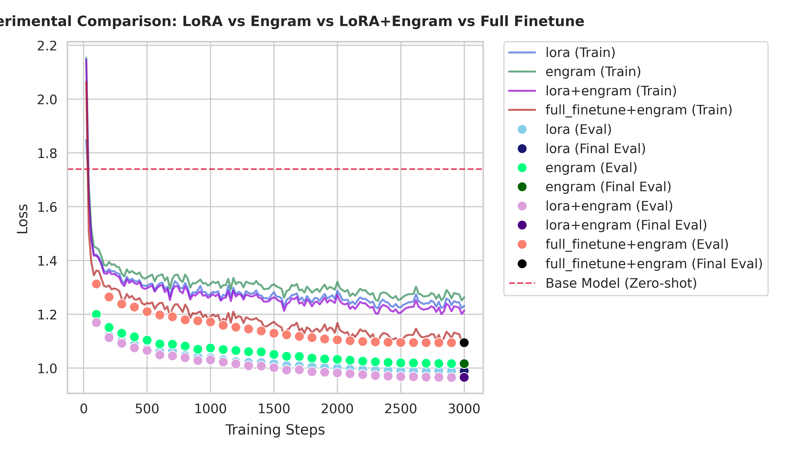

# Engram-PEFT

[English] | [中文](README_zh.md)

> [!IMPORTANT]
> This is an **unofficial implementation** of the DeepSeek Engram paper ([arXiv:2601.07372](https://arxiv.org/abs/2601.07372)). [DeepSeek-AI official demo is here](https://github.com/deepseek-ai/Engram).

[](LICENSE)
[](https://qinggo.github.io/engram-peft/)

**Engram-PEFT** is a high-performance, 100% paper-aligned implementation of the DeepSeek Engram architecture. It provides a PEFT-style interface to inject conditional memory into any Transformer-based LLM, while also supporting stacked-adapter and full-finetuning workflows through explicit `train_mode` controls.

Engram decouples **static knowledge storage** from **dynamic reasoning** using a sparse retrieval mechanism, allowing models to scale their factual memory without increasing inference FLOPs or interfering with core logic.

---

## 🚀 Quick Start

### Installation

```bash
pip install engram-peft
```

To run examples or contribute to development, install the project with development dependencies:

```bash
# Using uv (recommended)
uv sync --all-groups

# Using pip
pip install -e ".[dev]"
```

### 5-Minute Example

```python
from transformers import AutoModelForCausalLM, AutoTokenizer
from engram_peft import EngramConfig, get_engram_model

# 1. Load base model
base_model = AutoModelForCausalLM.from_pretrained("TinyLlama/TinyLlama-1.1B-intermediate-step-1431k-3T")
tokenizer = AutoTokenizer.from_pretrained("TinyLlama/TinyLlama-1.1B-intermediate-step-1431k-3T")

# 2. Inject Engram layers (aligned with arXiv:2601.07372)
config = EngramConfig(target_layers=[2, 11, 20])
model = get_engram_model(
    base_model,
    config,
    tokenizer,
    train_mode="engram_only",
)

# 3. Quick check on trainable parameters
model.print_trainable_parameters()
# trainable params: ... (backbone: 0, engram: ...) || all params: ... || trainable%: ...
```

### YAML-Driven Training (CLI)

You can also trigger training through a YAML configuration file without writing Python scripts:

```bash
# 1. Generate a full, documented configuration template
engram-peft config-template --output training_config.yaml
```

The generated YAML is structured into five main sections:
- `model_name_or_path`: Base model identifier.
- `engram_config`: Core hyperparameters for Engram layers.
- `lora_config`: (Optional) PEFT LoRA settings for hybrid adaptation.
- `training_args`: Standard `transformers.TrainingArguments`.
- `data_args`: Dataset settings and tokenization logic.

# 2. Launch training using the YAML file (or our minimal examples/config.yaml)
engram-peft train --config training_config.yaml

# 3. Post-Training Inference
The CLI automatically generates a ready-to-run `inference.py` script in your `output_dir`.
```bash
uv run python outputs/tinyllama-lora-engram/inference.py
```

# 4. Override specific arguments on the fly
engram-peft train --config training_config.yaml --overrides "training_args.learning_rate=5e-5"
```

---

## 📊 Performance Comparison

| Method | Params Added | Speed (s/step) | Training Loss | Eval Loss | Peak Memory (JSON) |
| :--- | :--- | :--- | :--- | :--- | :--- |
| **LoRA** (r=16) | ~2.25 M | **0.2738 s** | 1.231 | 0.9890 | 8.07 GB |
| **Engram-PEFT** | **545.4 M** | 0.2961 s | 1.263 | 1.0165 | 9.38 GB |
| **LoRA+Engram** | ~547.7 M | 0.3360 s | **1.214** | **0.9656** | 10.33 GB |
| **Full Finetune+Engram** | ~545.4 M | 0.3818 s | 1.111 | 1.0944 | 15.32 GB |

> [!TIP]
> **Performance Insight**: In our latest benchmark (Test 8 & 9, TinyLlama-1.1B, 3000 steps), **LoRA+Engram** achieved the best convergence (lowest eval loss), outperforming standalone LoRA by ~2.3%, Engram by ~5.0%, and Full Finetune+Engram by ~12.2%. Engram-PEFT provides **240x more parameter capacity** (545M) for knowledge storage with minimal latency penalty. Use LoRA+Engram to leverage both structural adaptation and high-capacity sparse memory. Full Finetune+Engram, while more memory-intensive, shows competitive performance but requires significantly more GPU resources and exhibits potential overfitting tendencies.

### Loss Curve Comparison


*\* Engram employs sparse lookup; only a tiny fraction of parameters (approx. 1%) are active and receive gradient updates per step. To reproduce these benchmarks on your own hardware, run `uv run python examples/compare_engram_lora.py --all`. For a detailed breakdown of performance, computation, and memory, see our [Performance Analysis](docs/compare_engram_lora_analysis.md).*

---

## 🛠 Features

- **100% Paper Alignment**: Implements Appendix A Table 5 parameters and the official DeepSeek gating/hashing logic.
- **CPU Prefetching & Precomputation**: `EngramDataCollator` pre-calculates multi-head hash indices on the CPU. By using `num_workers > 0`, these indices are prefetched in parallel with training, ensuring zero hashing overhead on the GPU.
- **Tokenizer Compression**: Built-in NFKC and lowercase normalization for 23% vocabulary reduction.
- **Cross-Model Weight Migration**: A unique feature (see `weight_transfer.py`) that allows migrating Engram weights between different models (e.g., Llama to Qwen) using character-level alignment on a corpus—effectively "recycling" learned knowledge.
- **Zero-Invasive**: Injects via forward hooks; no modification to your base model architecture required.
- **Peft-like API**: Familiar methods like `print_trainable_parameters()` and `save_pretrained()`.
- **Explicit Training Modes**: `train_mode="engram_only"`, `"preserve_trainable"`, and `"full_finetune"` make backbone behavior predictable.
- **Combined Training (LoRA+Engram)**: Support for stacking adapters. Injects LoRA for structural fine-tuning and Engram for sparse knowledge retrieval in a single model.
- **Layered Optimizer Control**: Configure separate optimizers for backbone, Engram dense layers, and Engram sparse embeddings.
- **Named Adapters**: Industry-standard named adapter management (add/set/unload) for modular knowledge packs.
- **Automated Training**: Native `EngramTrainer` with built-in sparse Adam support and automatic sync of optimizer hyperparameters.
- **YAML-Driven CLI**: Fully declarative training workflow via YAML configurations with dynamic parameter overrides.
- **Automated Inference Generation**: Progress-tracking CLI that automatically creates ready-to-run `inference.py` scripts for immediate verification.
- **Mainstream Model Templates**: Out-of-the-box scripts for **Qwen 3.5-4B**, **Ministral-3-3B**, and **Gemma-4-E2B** with quantization support.
- **Multimodal & Hybrid Architecture Support**: Native support for recursive layer discovery in complex wrappers and synchronization of nested `text_config` attributes for state-of-the-art models.

---

## 📖 Documentation

For full details, see our documentation:
- [Tutorials](docs/tutorial.md): Quickstart and domain knowledge injection.
- [API Reference](docs/api.md): Detailed class and function documentation.
- [Paper Alignment](docs/paper_alignment.md): How we match the DeepSeek research.

### Training Mode Cheat Sheet

```python
# Engram-only PEFT
model = get_engram_model(base_model, config, tokenizer, train_mode="engram_only")

# Keep LoRA / existing trainable params
model = get_engram_model(model, config, tokenizer, train_mode="preserve_trainable")

# Full finetuning + Engram
model = get_engram_model(base_model, config, tokenizer, train_mode="full_finetune")
```

### Layered Optimizer Example

```python
from torch.optim import AdamW
from engram_peft import get_optimizer

optimizer = get_optimizer(
    model,
    backbone_learning_rate=5e-5,
    engram_dense_learning_rate=4e-4,
    engram_sparse_learning_rate=2e-3,
    backbone_optimizer=AdamW,
)
```

---

## 🎯 Citation

If you use this implementation in your research, please cite the original DeepSeek paper:

```bibtex
@article{deepseek2026engram,
  title={Conditional Memory via Scalable Lookup: A New Axis of Sparsity for Large Language Models},
  author={DeepSeek-AI},
  journal={arXiv preprint arXiv:2601.07372},
  year={2026}
}
```

---

## 🤝 Contributing

We welcome contributions! Please see our [Contributing Guide](CONTRIBUTING.md) for details on our tiered development workflow (L1-L4) and testing standards.

## 📄 License

Apache License 2.0. See [LICENSE](LICENSE) for details.
