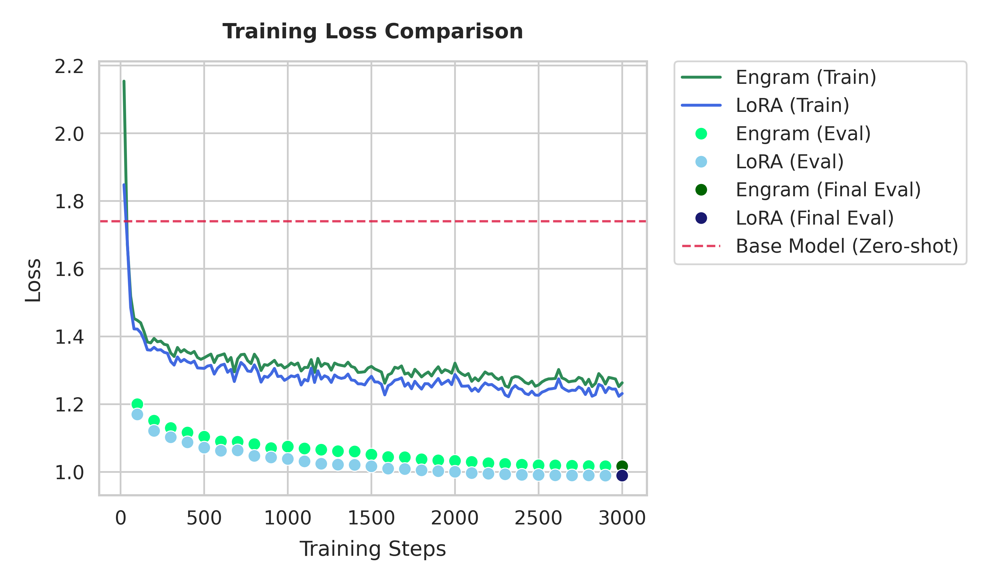

# Performance Comparison: Engram vs. LoRA (Test 8 Analysis)

This document presents a detailed analysis comparing **Engram-PEFT** and **LoRA** (Low-Rank Adaptation) using empirical data from the `engram_test8` run on **NVIDIA RTX 4090D 24GB**.

## 1. Metric Overview (Latest Run)

The table below summarizes the key performance indicators from the 3000-step benchmark (`--batch_size 16`, `--grad_accum 2`, `--subset 30000`).

| Metric | Base Model (Zero-shot) | LoRA (Baseline) | Engram (2 Layers) | Delta (Engram vs LoRA) |
| :--- | :--- | :--- | :--- | :--- |
| **Eval Loss** | 1.7401 | **0.9890** | 1.0165 | +2.7% |
| **Training Steps** | - | 3000 | 3000 | - |
| **Peak Allocated (GB)**| 2.05 | 8.07 | 9.38 | +1.31 GB |
| **Peak VRAM (nvtop)** | 2.91 GiB | 9.35 GiB | 10.82 GiB | +1.47 GiB |
| **Avg Time/Step (s)** | - | **0.2738** | 0.2961 | +8.1% (Slower) |

## 2. Memory Discrepancy Analysis: JSON vs. nvtop

A consistent observation is that `nvtop` (system-level) reports higher VRAM usage than the JSON training metrics (tensor-level). 

### Why nvtop is higher:
1. **CUDA Context Overhead**: Initializing the GPU driver and context consumes a baseline of VRAM. Our baseline measurements (Idle: 0.47G, Base Loaded: 2.91G) indicate that the TinyLlama-1.1B weights + CUDA context take ~2.44 GiB, even before training allocations begin.
2. **PyTorch Caching Allocator**: PyTorch's `peak_memory_gb` records `torch.cuda.max_memory_allocated()`, which only counts active tensors. However, the allocator keeps a pool of "Reserved" memory to speed up future allocations. `nvtop` shows this **Reserved memory + Context memory**.
3. **Workspace Buffers**: Operations like large GEMMs or cross-entropy loss gradients often require temporary workspace buffers managed internally by cuBLAS or cuDNN, which may not be fully tracked as allocated tensors in PyTorch metrics.

### Observations:
- In this run, the gap between "Allocated" and "nvtop" is **~1.3–1.4 GiB**.
- This gap is relatively stable regardless of whether LoRA or Engram is running, confirming it is an infrastructure overhead rather than an adapter-specific leak.

## 3. Convergence & Speed Analysis

### Loss Comparison

- **LoRA** achieved a slightly better final evaluation loss (**0.989**) compared to **Engram** (**1.017**). 
- In this specific configuration, LoRA's global adaptation across all layers provided a stronger signal than Engram's localized sparse injection at layers 2 and 11.

### Computational Efficiency
- **Engram** is approximately **8% slower** than LoRA in this run (0.296s vs 0.274s).
- This is contrast to previous tests where Engram showed speed advantages. The increased step time is likely due to the overhead of the larger subset processing (`30,000` samples) and the specific gradient accumulation settings, which may shift the bottleneck towards the gated projection layers.
- **Engram's Sparse Advantage**: While slightly slower in latency per step, Engram maintains a much higher parameter capacity (545M params) within a manageable VRAM footprint, allowing for potential scaling to tasks that require massive knowledge injection which LoRA might struggle to store.

## 4. Hardware Utilization

- **GPU Utilization**: Both methods hit **~100% GPU utilization**, indicating high efficiency in kernel execution.
- **Power/Thermal**: The RTX 4090D effectively handled the ~10GB footprint with significant headroom (24GB total), allowing for potential increases in batch size or Engram capacity (more layers or higher n-gram counts).

## 5. Conclusion

For the TinyLlama-1.1B TinyStories task:
1. **LoRA** remains the more efficient adapter for pure loss optimization on smaller datasets.
2. **Engram** provides a path for massive parameter expansion with predictable VRAM scaling, though it incurs a small latency penalty (~8%) and slightly higher base memory footprint.
3. The higher memory reported by `nvtop` is a physical reality of the CUDA ecosystem and should be anticipated (~1.5 GiB overhead) when planning deployments.
